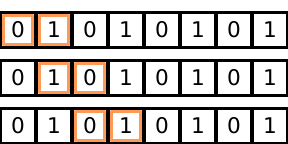
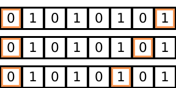

This document presents _Views_ which are Seashell's zero-cost abstraction for
structured iteration. The Seashell type system provides a safe access
guarantee, i.e., a program that typechecks never tries to access the same
memory bank in the same cycle. To provide this guarantee, the type system
needs the programmer to expose the iteration pattern they are using on a
logical array in the program. _Views_ provide a mechanism to expose the iteration
pattern to the type system without having to pay the cost of creating a new memory
bank. _Views_ are a _zero-cost abstraction_ because they only exist in Seashell
and are compiled into simple array accesses.

## Creating views

A _view_, as it's name suggests, is a logical view over a pre-existing array.
To create a _view_ we use the following syntax:

```
int[8 bank(2)] a;
v_a = view[w=2, off=0] a;
```


This creates a _view_ `v_a` on array `a` that has width (`w`) of 2. The `off`
represents the starting point of the _view_. A _view_ expression
also _consumes_ array `a` from the current context which means `a` can no
longer be accessed in the current scope. The variable `v_a` created from this
view expression simply acts as an array. For example, we can write:

```
for (i = 0..2) {
    v_a[i] := 10
}
```

However, the _view_ in this example isn't very interesting since it remains
static. In order to specify an iteration strategy using a _view_, we can use
a dynamic `off` value:

```
int [8 bank(2)] a;
for (i = 0..3) {
    v_a = view[w=2, off=i];
}
```

which creates the following iteration pattern:



And again, since `v_a` just acts as a simple array, we can do the following:

```
for (i = 0..3) {
    v_a = view[w=2, off=i];
    for (j = 0..2) {
        v_a[j] := 1;
    }
}
```

While this syntax can express simple block-based iteration strategies, it is
not expressive enough to specify iterations where we skip some elements. We
extend the notation of _views_ to add a _stride_ operator:

```
int[8 bank(2)] a;
v_a = view[w=2, s=2, off=0];
```

which creates the following _view_:


When omitted, stride is set to $1$, which creates a block-like view.

## Typing a view

As mentioned before, _views_ are treated as simple arrays once they are created.
An array is defined as follows:

```
v_a : t[s bank(b)]
```

where `s` is the size of the array and `b` is the banking factor. To typecheck
a view, we first need to infer its type, or more specifically, the values for
`s` and `b`.

First, assume we have the following expression:

```
t[s_a bank(b_a)] a;
v_a = view[w, s, off] a; // v : t_v[s_v bank (b_v)]
```

and the assumptions $s_a \geq b_a$, $s_v \geq b_v$ and, $w \leq s_a$.

Inferring the first two components of the _view_ is straigtforward.

$$
t_v = t \\
s_v = w \text{ if } (o + (w - 1) \times s - 1) \leq s_a
$$

Next, we need to infer $b_v$. To do so, we first write down $b_e$ which the
the maximum possible banking factor that $v_a$ can have given the stride $s$.

$$
b_e = \frac{b_a}{\text{gcf}(s, b_a)}
$$

See [this proof](https://www.quora.com/What-is-the-general-order-of-an-element-of-a-cyclic-group-of-order-n)
to understand how we get this. Using $b_e$, we can say:

$$
b_v = \min(w, b_e)
$$

Note that we don't use the value of $o$ in the description of $b_v$ because of
the aforementioned result.

## Unrolled loops and views

Since _views_ are just arrays, we can write:

```
int[8 bank(2)] a;
v_a = view[w=2, off=0] a;
for (j = 0..2) unroll 2 {
    v_a[j] := 1
}
```

However, we also impose a restriction on the usage of creation of views using
and unrolled iterator value. So, the following program is invalid:

```
for (i = 0..8) unroll 2 {
    v_a = view[w=2, off=i]
}
```

This is because it is unclear what a _view_ that is generated by a value space
(the set of values represented by an index type) is.

## Limitations

While _views_ significantly improve the expressive power of array iterations,
in their current form, they are still more restrictive that iteration patterns
defined using `a[i + j]`.

### Inexpressible iteration patterns

* **Skipping with block based views**. While it is fairly straightforward to
  skip elements with simple _views_, we cannot represent iterations of that both
  use a view of width more than one and step more than one element. For example,
  the following iteration pattern cannot be expressed:

  

* **Dynamic strides**. Iteration patters where the stride dynamically changes
  cannot be specified using the _view_ syntax. For example, the following iteration
  pattern is not expressible.
  
    

### Inexpressible parallel operations

Currently, Seashell offers no way to express parallelism of the form "read
values from two distinct banks in one array, and store their sum in a new
memory"


::: formula

The first inexpressibility can be overcome with a notion of steps in the iterators
themselves.

For the second inexpressibility, I don't see a reason why we can't also make
the stride dynamic now that we are restricting the offset to simple integers.

The final limitation is orthogonal to the concept of _views_.

Let Rachit know if there are other limitations you can think of.

:::